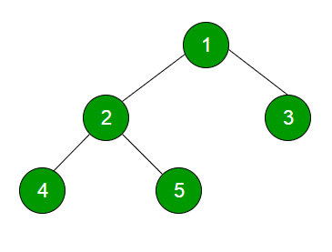

# algorithms

## References

- [Tech Interview Handbook](https://www.techinterviewhandbook.org/)
- [Basecs](https://medium.com/basecs)
- [Leetcode Learn](https://leetcode.com/explore/learn/)

## Topics

- [Basics](#basics)
- [Arrays](#arrays)
- [String](#string)
- [Stack](#stack)
- [Queue](#queue)
- [LinkedList](#linkedlist)
- [Hash Table](#hash-table)
- [Tree](#tree)
- [Graph](#graph)
- [Heap](#heap)

### Basics

### Arrays

**Resources**

- [Arrays 1](https://www.geeksforgeeks.org/arrays-in-java/)
- [Arrays 2](https://docs.oracle.com/javase/tutorial/java/nutsandbolts/arrays.html)

An array is a collection of items of same data type stored at contiguous memory locations.

```java
public class Array {

    public static void main(String... args) {
        int[] a = new int[5];
        int[] b = new int[]{};
        int[] c = new int[]{1, 2, 3};

        a[2] = 5;
    }
}
```

**Time Complexity**

| Operation             | Big O     | Note                                                                             |
|-----------------------|-----------|----------------------------------------------------------------------------------|
| Access                | O(1)      |                                                                                  |
| Search                | O(n)      |                                                                                  |
| Search (sorted array) | O(log(n)) |                                                                                  |
| Insert                | O(n)      | Insertion would require shifting all the subsequent elements to the right by one |
| Insert (at the end)   | O(1)      |                                                                                  |
| Remove                | O(n)      | Removal would require shifting all the subsequent elements to the left by one    |
| Remove (at the end    | O(1)      |                                                                                  |

### String

A string is a sequence of characters.

**Time Complexity**

| Operation                                        | Big O  | Note                                 |
|--------------------------------------------------|--------|--------------------------------------|
| Access                                           | O(1)   |                                      |
| Search                                           | O(n)   |                                      |
| Insert                                           | O(n)   |                                      |
| Remove                                           | O(n)   |                                      |
| Find substring                                   | O(n.m) | Assuming other string is of length m |
| Concatenating strings                            | O(n+m) | Assuming other string is of length m |
| Strip (removing leading and trailing characters) | O(n)   |                                      |

### Stack

**Time Complexity**

| Operation | Big O | Note |
|-----------|-------|------|

**Pointers for Interview**

- A

### Queue

**Time Complexity**

| Operation | Big O | Note |
|-----------|-------|------|

**Pointers for Interview**

- A

### LinkedList

**Time Complexity**

| Operation | Big O | Note |
|-----------|-------|------|

**Pointers for Interview**

- A

### Hash Table

A hash table is a data structure that can map keys to values. A hash table uses a hash function on an element to compute
an index, also called a hash code, into an array of buckets or slots, from which the desired value can be found. During
lookup, the key is hashed and the resulting hash indicates where the corresponding value is stored.

Instead of linearly searching an array every time to determine if an element is present, which takes O(n) time, we can
traverse the array once and hash all the elements into a hash table.

Collisions occur whenever a hash table's hashing function generates the same index for more than one key.

**What makes a good Hash Table?**

- It should be easy to compute. Hard to compute hash functions mean that we lose any advantage for quick and efficient
  lookup time.
- It should avoid collision. Collisions are unavoidable but the more the collisions, the harder it is to come up with a
  fast, efficient algorithm for resolving them.
- It should use all the input data, and always return the same key for the same hash bucket per value.

**Time Complexity**

| Operation | Big O | Note                                                    |
|-----------|-------|---------------------------------------------------------|
| Access    | N/A   | Accessing is not possible as the hash code is not known |
| Search    | O(1)  |                                                         |
| Insert    | O(1)  |                                                         |
| Remove    | O(1)  |                                                         |

**Pointers for Interview**

- A

### Tree

A tree is an abstract data type that represents a hierarchical structure with a set of connected nodes. Each node in a
tree can be connected to many children, but must be connected to exactly one parent, except the root node, which has no
parent.

**Common terms**

- **Neighbor** - Parent or child of a node
- **Ancestor** - A node reachable by traversing its parent chain
- **Descendant** - A node in the node's subtree
- **Degree** - Number of children of a node
- **Distance** - Number of edges along the shortest path between two nodes
- **Level/Depth** - Number of edges along the unique path between a node and the root node
- **Width** - Number of nodes in a level

#### Binary Tree

Binary means two, so nodes in a binary tree have a maximum of two children.

**Binary Tree terms**

- Complete binary tree - Every level except possibly the last, completely filled, and all nodes in the last level are as
  far left as possible.
- Balance binary tree - A binary tree structure in which the left and the right subtrees of every node differ in height
  by no more than 1.

**Traversals**

- In-order traversal - Left -> Root -> Right
- Pre-order traversal - Root -> Left -> Right
- Post-order traversal - Left -> Right -> Root

#### Binary Search Tree

In a Binary Search Tree, all the nodes to the left of the root node must be less than the value of the root node. All
the nodes to the right of the root node must be greater than the value of the root node.

All the subtrees to the left of the node will always be smaller in value than the subtrees to the right of a node, this
applies not just to the main overarching tree structure, but to every single nested subtree as well.

**Time Complexity**

| Operation | Big O     | Note |
|-----------|-----------|------|
| Access    | O(log(n)) |      |
| Search    | O(log(n)) |      |
| Insert    | O(log(n)) |      |
| Remove    | O(log(n)) |      |

### Graph

**Time Complexity**

| Operation | Big O | Note |
|-----------|-------|------|

**Pointers for Interview**

- A

### Heap

**Time Complexity**

| Operation | Big O | Note |
|-----------|-------|------|

**Pointers for Interview**

- A

## Techniques

- [Binary Search](#binary-search)
- [Breadth First Search](#breadth-first-search)
- [Depth First Search](#depth-first-search)
- [Merge Sort](#merge-sort)
- [Two Pointer](#two-pointer)
- [Sliding Window](#sliding-window)
- [Recursion](#recursion)
- [Dynamic Programming](#dynamic-programming)
- [Backtracking](#backtracking)
- [Bit Manipulation](#bit-manipulation)

### Binary Search

### Breadth First Search



```text
Output

1
2 3
4 5
```

```java
class Node {
    int data;
    Node left, right;

    public Node(int data) {
        this.data = data;
        left = right = null;
    }
}

class BinaryTree {
    Node root;

    public BinarySearch() {
        root = null;
    }

    void printLevelOrder() {
        int h = height(root);
        for (int i = 1; i <= h; i++) {
            printCurrentLevel(root, i);
        }
    }

    int height(Node root) {
        if (root == null) {
            return 0;
        } else {
            int leftHeight = height(root.left);
            int rightHeight = height(root.right);

            if (leftHeight > rightHeight) {
                return leftHeight + 1;
            } else {
                return rightHeight + 1;
            }
        }
    }

    void printCurrentLevel(Node root, int level) {
        if (root == null) return;

        if (level == 1) {
            System.out.println(root.data + " ");
        } else if (level > 1) {
            printCurrentLevel(root.left, level - 1);
            printCurrentLevel(root.right, level - 1);
        }
    }
}
```

### Depth First Search

**Inorder Traversal**

- Traverse the left subtree
- Visit the root
- Traverse the right subtree

```java
class Node {
    int data;
    Node left, right;

    public Node(int data) {
        this.data = data;
        left = right = null;
    }
}

class BinaryTree {

    Node root;

    BinaryTree() {
        root = null;
    }

    void printInOrder(Node node) {

        if (node == null) return;

        printInOrder(node.left);
        System.out.println(node.data + " ");
        printInOrder(node.right);
    }

    void printInOrder() {
        printInOrder(root);
    }
}
```

```text
Output

4 2 5 1 3
```

**Preorder Traversal**

- Visit the root
- Traverse the left subtree
- Traverse the right subtree

```java
class Node {
    int data;
    Node left, right;

    public Node(int data) {
        this.data = data;
        left = right = null;
    }
}

class BinaryTree {

    Node root;

    BinaryTree() {
        root = null;
    }

    void printPreOrder(Node node) {

        if (node == null) return;

        System.out.println(node.data + " ");
        printInOrder(node.left);
        printInOrder(node.right);
    }

    void printPreOrder() {
        printPreOrder(root);
    }
}
```

```text
Output

1 2 4 5 3
```

**Postorder Traversal**

- Traverse the left subtree
- Traverse the right subtree
- Visit the root

```java
class Node {
    int data;
    Node left, right;

    public Node(int data) {
        this.data = data;
        left = right = null;
    }
}

class BinaryTree {

    Node root;

    BinaryTree() {
        root = null;
    }

    void printPostOrder(Node node) {

        if (node == null) return;

        printInOrder(node.left);
        printInOrder(node.right);
        System.out.println(node.data + " ");
    }

    void printPostOrder() {
        printPostOrder(root);
    }
}
```

```text
Output

4 5 2 1 3
```

### Merge Sort

### Two Pointer

**Resources**

- [Two Pointer Technique](https://www.codingninjas.com/codestudio/library/what-is-a-two-pointer-technique)
- [Two Pointer Technique 2](https://afteracademy.com/blog/what-is-the-two-pointer-technique)

**Two Pointer** is a technique in which two pointers iterate across the data structure until one or both of them satisfy
the necessary condition. It is the use of two different pointers (usually to keep track of array or string indices) to
solve a problem.

**Problem Types**

- One slow-runner and the other fast-runner.
- One pointer starts from the beginning while the other pointer starts from the end.

**Example 1: Reversing a String with two pointer technique**

```java
public class ReverseString {

    private void reverse(char[] str) {
        int i = 0, j = str.length - 1;
        while (i < j) {
            swap(str, i, j);
            i++;
            j--;
        }
    }

}
```

**Example 2: Given a sorted array A and an integer target, find if there exists `A[i]` and `A[j]` such
that `A[i] + A[j] = target`, where `i != j`**

- Set pointer 1 to index `0` and pointer 2 to `len(A) - 1`, they represent the smallest and the largest integers as the
  array is sorted
- Compute the sum of the two numbers pointed to at each step
- If the sum is greater than the target, we need to reduce the right pointer value. If the sum is smaller than the
  target, we need to increase the left pointer value

```java
public class TwoSumSortedArray {

    private int isPairSum(int[] A, int target) {

        int p1 = 0;
        int p2 = A.length - 1;

        while (p1 < p2) {
            if (A[p1] + A[p2] == target) return 1;
            else if (A[p1] + A[p2] < target) p1++;
            else p2--;
        }

        return 0;
    }

}
```

### Sliding Window

**Resources**

- [Sliding Window Technique](https://stackoverflow.com/a/64111403/5331198)
- [Sliding Window Technique 2](https://www.youtube.com/watch?v=MK-NZ4hN7rs)

The **Sliding Window** technique aims to reduce the time complexity of a problem by reducing use of nested loop and
replace it with a single loop.

**Recognizing Sliding Window problems**

- Contiguous sequence of elements
- String, Arrays, LinkedList
- Finding minimum, maximum, longest, shortest, contained within a subset

**How to use Sliding Window technique**

- Find the size of the window
- Compute result of 1st window
- Use a loop to slide the window by 1, and keep computing the result window by window

**Example 1: Given an array of integers, calculate the sum of `k` consecutive elements in the array**

- We compute the sum of the first `k` elements out of `n` terms using a linear loop and store it as `windowSum`
- Then slide over the array by 1 element at a time, keeping track of the `maximumSum`
- To get the current `windowSum` of k elements we subtract the first element from the previous window and add the last
  element of the current window

```java
public class SumOfKConsecutiveElements {

    private int kSum(int[] arr, int k) {

        int len = arr.length;

        if (len < k) return -1;

        //compute sum of first window
        int maxSum = 0;
        for (int i = 0; i < k; i++) {
            maxSum += arr[i];
        }

        /**
         * compute sum of remaining windows 
         * by removing the first element of previous window
         * and adding the last element of the current window
         */
        int windowSum = maxSum;
        for (int i = k; i < len; i++) {
            windowSum += arr[i] - arr[i - k];
            maxSum = Math.max(maxSum, windowSum);
        }

        return maxSum;
    }
}
```

### Recursion

### Dynamic Programming

Dynamic programming is an approach to solving complex problems by breaking them down into smaller parts, and storing the result of these subproblems so that they only need to be computed once.

```java
//Recursive Approach
static int fib(int n) {
    if (n <= 1) {
        return n;    
    }
    return fib(n - 1) + fib(n - 2);
}
```

There are two different ways to store values:

- Memoization (Top-Down Approach)
- Tabulation (Bottom-Up Approach)

```java
//Memoization (Top-Down Approach)
public class Fibonacci {
    
    final int MAX = 100;
    final int NIL = -1;
    
    int[] lookup = new int[MAX];
    
    void initialize() {
        for (int i = 0; i < MAX; i++) {
            lookup[i] = NIL;
        }
    }
    
    int fib(int n) {
        if (lookup[n] == NIL) {
            if (n <= 1) {
                lookup[n] = n;
            } else {
                lookup[n] = fib[n - 1] + fib[n - 2];
            }
        }
        return lookup[n];
    }
}
```

```java
//Tabulation (Bottom-Up Approach)
public class Fibonacci {
    
    int fib(int n) {
        int[] f = new int[n + 1];
        f[0] = 0;
        f[1] = 1;
        for (int i = 2; i <= n; i++) {
            f[i] = f[i - 1] + f[i - 1];
        }
        return f[n];
    }
}
```

### Backtracking

### Bit Manipulation

## General Tips

- Time yourself while solving problems.
- Don't jump into the problem immediately. Try to understand it and formulate a solution with the data you have.
- Ask clarifying questions about the problem or anything that you don't understand.
    - Input/Output
    - Edge cases
    - How is the input stored?
    - Ask about range of input and negative cases.
    - Can you use more memory? Or need to do it in-place?
    - Ask about duplicates, `null`, negative numbers, overflow, underflow.
- Talk out loud. Have a conversation with the interviewer.
- Write comments.
- Write compilable code. Don't use short forms.
- Test the code.
- Talk about time complexity.
- Are there any optimizations that can be done?
- Coding
    - Use `Integer.compare`, `Double.compare` for comparison.
    - Be mindful about slicing or concatenating arrays. Typically, slicing and concatenating arrays would take O(n)
      time. Use `start` and `end` indices to demarcate a subarray/range where possible.
