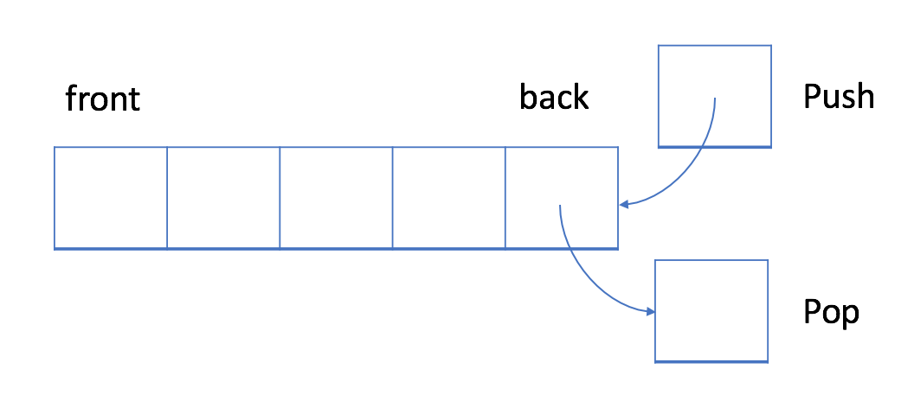

# algorithms

## References

- [Tech Interview Handbook](https://www.techinterviewhandbook.org/)
- [Basecs](https://medium.com/basecs)
- [Leetcode Learn](https://leetcode.com/explore/learn/)

## Topics

- [Basics](#basics)
- [Arrays](#arrays)
- [String](#string)
- [LinkedList](#linkedlist)
- [Stack](#stack)
- [Queue](#queue)
- [Tree](#tree)
- [Graph](#graph)
- [Hashing](#hashing)
- [Matrix](#matrix)
- [Heap](#heap)
- [Trie](#trie)

### Basics

> There are two major points to consider when thinking about how an algorithm performs: how much time it requires at runtime and memory it needs.

### Arrays

Arrays hold value of the same type at contiguous memory locations. In an array, we're usually concerned about two things - the position/index of an element and the element itself.

#### Advantages

- Accessing elements is fast as long as you have the index.

#### Disadvantages

- Addition and removal of elements into/from the middle of an array is because the remaining elements need to be shifted to accommodate the new/missing element.
- For certain languages where the array size is fixed, we cannot alter its size after initialization.

#### Time complexity

| Operation           | Big O     | Note                                                                                          |
|---------------------|-----------|-----------------------------------------------------------------------------------------------|
| Access              | O(1)      |                                                                                               |
| Search              | O(n)      |                                                                                               |
| Search sorted array | O(log(n)) |                                                                                               |
| Insert              | O(n)      | Insertion would require all the subsequent elements to the right by one and that takes O(n)   |
| Insert at the end   | O(1)      |                                                                                               |
| Remove              | O(n)      | Removal would require shifting all subsequent elements to the left by one and that takes O(n) |

#### Things to look out for during interview

- Clarify if there are duplicate values. Would the presence of duplicate values affect the answer?
- While iterating through the array elements using an index, be careful not to go out of bounds.

#### Corner cases

- Empty array
- Sequence with 1 or 2 elements
- Sequence with repeated elements
- Duplicated values in the sequence

#### Techniques

- Sliding Window
- Two Pointers
- Traversing from the right
- Sorting the array
- Traversing the array more than once

### String

A String is a sequence of characters. 

#### Compare function

> Can we use "==" to compare two strings?

It depends on the answer to the question:

> Does the language support operator overloading?

- If the answer is `yes` (like `C++`), we may use "==" to compare two strings
- If the answer is `no` (like `Java`), we may not use "==" to compare two strings. When we use "==", it actually compares whether the two objects are the same object.

#### Immutable or Mutable

`Immutable` means that you can't change the content of the string once it's initialized. 

In `Java` the string is `immutable`. Here, concatenation works by first allocating enough space for the new string, copy the contents from the old string and append to the new string.

The time complexity of concatenation is O(n<sup>2</sup>).

> The time complexity of both find operation and substring operation is `O(n)`.
 
| Operation           | Big O     |
|---------------------|-----------|
| Access              | O(1)      |
| Search              | O(n)      |
| Insert              | O(n)      |
| Remove              | O(n)      |

#### Things to look out for during interview

- Ask about input character set and case sensitivity

#### Corner cases

- Empty string
- String with 1 or 2 characters
- String with repeated characters
- Strings with only distinct characters

#### Techniques

- Counting characters
- Anagram
- Palindrome

### LinkedList

LinkedLists are linear data structures, which means that there is a sequence and an order to how they are constructed and traversed.

The fundamental difference between arrays and linked lists is that arrays are **static data structures**, while linked lists are **dynamic data structures**. 
A static data structure needs all of its resources to be allocated when the structure is created. If more elements needed to be added to a static data structure, and it didn't have enough memory, you'd need to copy the data of that array, for example, and recreate it with more memory.
Dynamic data structures can shrink and grow in memory. It doesn't need a set amount of memory to be allocated in order to exist, and its size and shape can change, and the amount of memory it needs can change as well.

A linked list is made up of a series of **nodes**, which are the elements of the list.

```java
public class Node {
    int data;
    Node next;
    
    public Node(int data) {
        this.data = data;
        this.next = null;
    }
}

public class LinkedList {
    Node head;
}
```
> A node only knows about what data it contains, and who its neighbor is.

This is the reason why linked list doesn't need a contiguous block of memory. Because a single node has the "address" or a reference to the next node, they don't need to live right next to one another, the way that the elements have to in an array.

**Singly LinkedLists** are the simplest type of linked list, based solely on the fact that they only go in one direction. There is a single track that we can traverse the list in; we start at the **head** node, and traverse from the root until the last node, which will end at an empty **null** value.


**Doubly LinkedLists** have two references contained within each node: a reference to the next node, as well as the previous node.


> A LinkedList is usually efficient when it comes to adding and removing elements, but can be very slow to search and find a single element.

#### Time complexity

| Operation | Big O | Note                                                 |
|-----------|-------|------------------------------------------------------|
| Access    | O(n)  |                                                      |
| Search    | O(n)  |                                                      |
| Insert    | O(1)  | Assumes you have traversed to the insertion position |
| Remove    | O(1)  | Assumes you have traversed to the node to be removed |

#### Common routines

- Counting the number of nodes in the linked list
- Reversing a linked list
- Finding a middle node of the linked list using two pointers (fast/slow)
- Merging two linked lists together

#### Corner cases

- Empty linked list (head is null)
- Single node
- Two nodes
- LinkedList has cycles. **Tip:** Clarify beforehand with the interviewer whether there can be a cycle in the list. 

#### Techniques

- Sentinel/dummy nodes
  - Adding a sentinel/dummy node at the head and/or tail might help to handle many edge cases where operations have to be performed at the head or the tail
- Two pointers
  - Get the kth from last node - Have two pointers, where one is k nodes ahead of the other. When the node ahead reaches the end, the other node is k nodes behind
  - Detecting cycles - Have two pointers, where one pointer increments twice as much as the other, if the two pointers meet, means there is a cycle
  - Getting the middle node - Have two pointers, where one pointer increments twice as much as the other. When the faster node reaches the end of the list, the slower node will be at the middle
- Using space
  - Many linked list problems can be solved by creating a new linked list and adding nodes to the new linked list with the final result
- Elegant modification operations
  - Truncate a list - Set the `next` pointer to `null` at the last element
  - Swapping values of nodes - Just like arrays, just swap the value of the two nodes, there's no need to swap the `next` pointer
  - Combining two lists - attach the head of the second list to the tail of the first list

### Stack

In a LIFO data structure, the newest element added to the stack will be processed first. The stack is a LIFO data structure.

A stack is nothing more than a data structure that contains a bunch of elements. And, like linked lists, stacks are linear, which means that there is a sequence and an order to how they are constructed and traversed.



```java
import java.util.ArrayList;

public class Stack {
  private List<Integer> data;

  public Stack() {
    data = new ArrayList<>();
  }
  
  public void push(int val) {
      data.add(val);
  }
  
  public boolean isEmpty() {
      return data.isEmpty();
  }
  
  public int top() {
      return data.get(data.size() - 1);
  }
  
  public boolean pop() {
      if (isEmpty()) return false;
      data.remove(data.size() - 1);
      return true;
  }
}
```

### Queue

Queues abide by and operate, for the most part, according to the first-in, first-out principle. The first element in the queue, or the element at the front of the queue, is always the first to be processed and removed from the queue.


### Tree

### Graph

### Hashing

### Matrix

Similar to 1-dimensional array, a 2-dimensional array also consists of a sequence of elements. But the elements can be laid out in a `rectangular grid` rather than a line.

In Java, the 2-dimensional array is actually a 1-dimensional array which contains M elements, each of which is an array of N integers.


 
### Heap

### Trie
